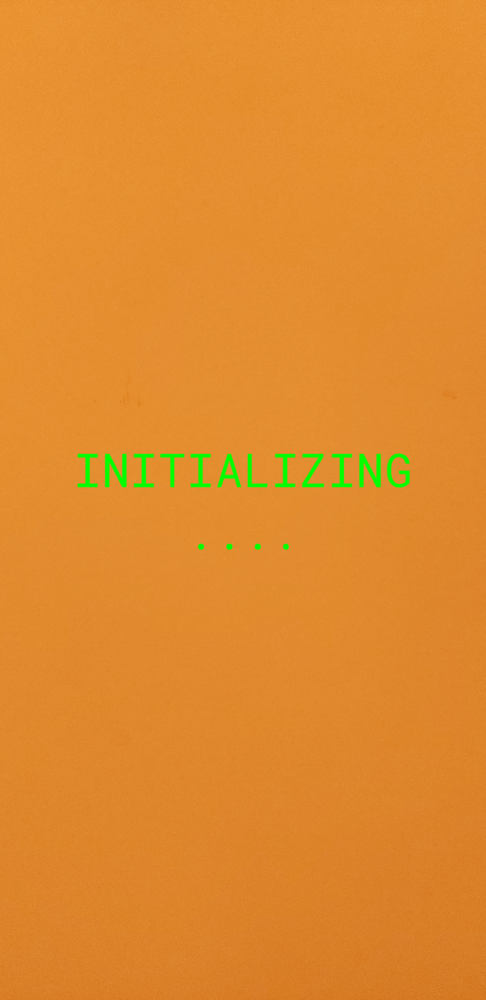
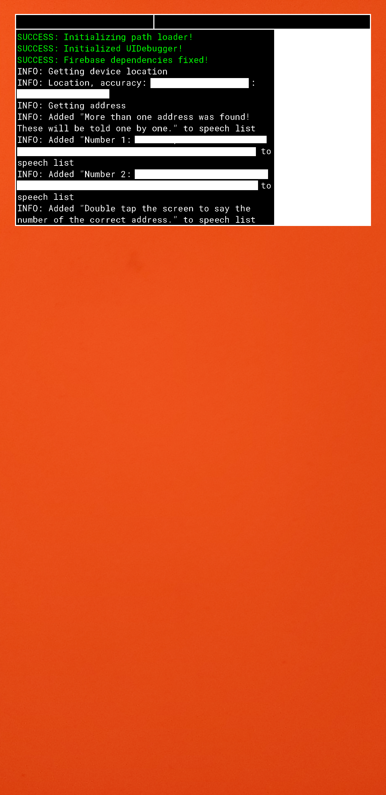
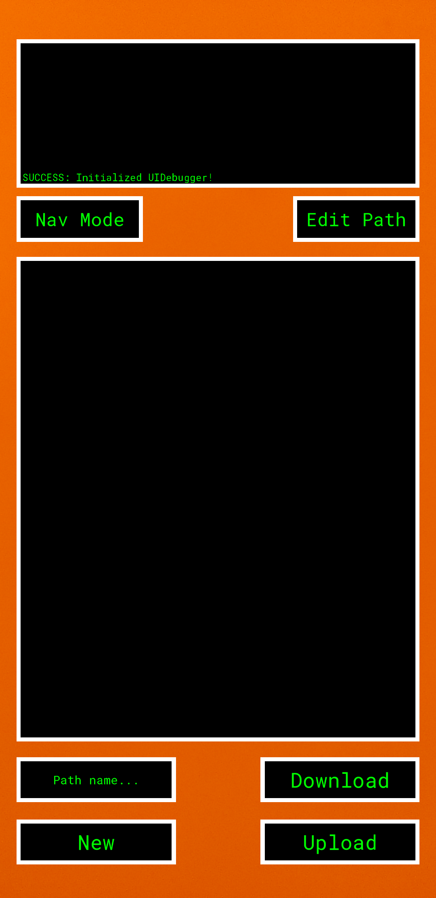
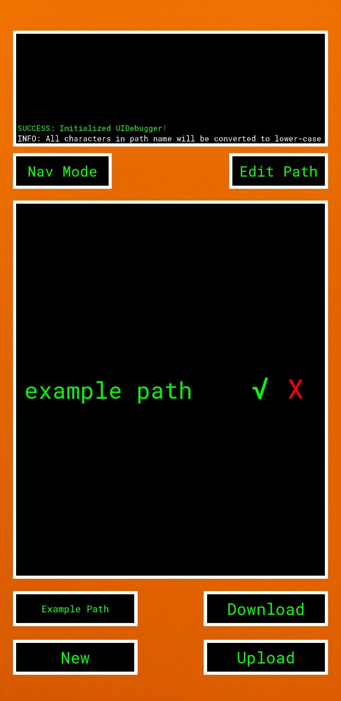
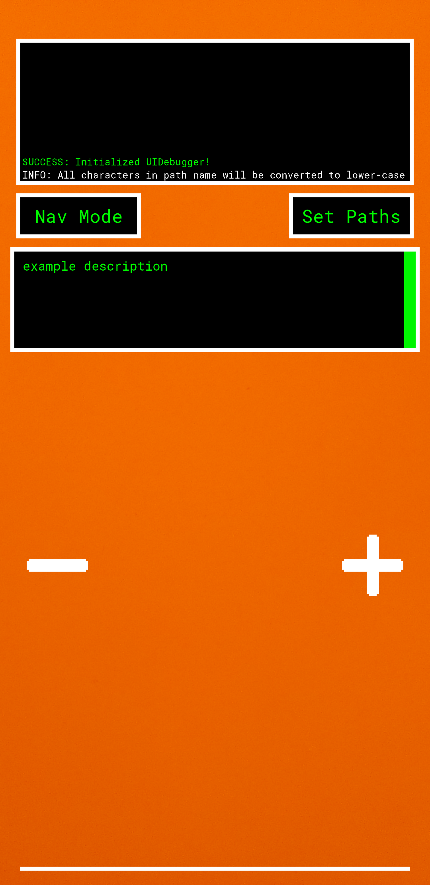

# Documentation for 3rDi 4 All v1.5.0
**[3rDi 4 All](https://play.google.com/store/apps/details?id=com.Uralstech.thirdifourall&pli=1) is an app for indoor navigation for the visually impaired. The app uses voice interaction to communicate with the user.
With turn-by-turn indication between points of interests, this is a mobility app for the visually impaired with real-time obstacle detection.**

**This is documentation for scanning/path creation of areas for enabling the app.
3rDi 4 All is still in development, and there certainly will be changes to how systems work in the app. Therefore, scans/paths created with
the help of one version of the app will not work with a newer version. If you find any issues with the app or documentation or have a feature request, please post it [*here!*](https://github.com/Uralstech/3rDi-4-All-Docs/issues)**

## Scanning/mapping an area for the first time

Open the app and wait for it to initialize. Give all the permissions it asks for!

Once **navigation mode** has been loaded, wait for the app to get your address. If more than one address is found, the app will ask you for the
correct one. Double-tap the screen and say the number of the correct address.

Once that's done, wait for the app to download any existing data from the servers. If no data exists, it will say "Could not download data from servers" - this is fine.

Now, double-tap the screen, and when it asks "Where do you want to go?", say "Scanner mode". The app should start loading **scanner mode**.

In scanner mode, the path setting window should be visible.
Click on the box that says "Path name..." on the bottom-left corner of the screen.
Enter the name of the path you want to create. Click the "New" button. Text with the name of the path should appear in the middle, with a "X" button to its right.
That button will delete the path. Click on the text instead.

 A checkmark should appear next to the text - the path has been selected. Now press the "Edit Path" button on the top-right corner of the screen.
 

The path setting window should now be visible. Enter a description for the path node you are about to create, and press the button with the plus symbol to create it.
Continue doing so till the path extends to the destination. If you made a mistake and want to remove an anchor, press the button with the minus symbol. Now, press the
"Set Paths" button on the top-right corner of the screen to go back to the path setting window.

Create more paths if needed - remember to select whichever path you want to edit. When you're done, press the "Upload" button on the bottom-right corner of the screen. The path and building data should be uploaded into the cloud.
Press the "Nav Mode" button on the top-left corner of the screen to go back to navigation mode.

Wait for the app to download the data from the cloud, and once it does, double-tap the screen and say the name of the path you want to take. And voila! the app should download the
path from the cloud. Once that's done, triple-tap the screen to hear the description you entered for the nearest path node.

## Editing an existing scan/map
Follow the above steps till you open scanner mode. Once you do, press the "Download" button to download existing paths from the cloud. Now follow the rest of the instructions as normal.